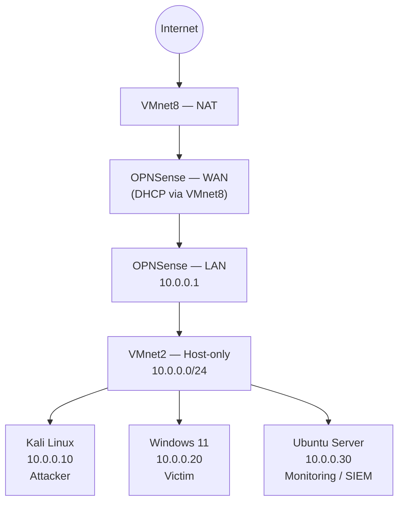

# Phase 0 — Environment Setup

> Status: ✅ Complete

Before any attack, detection, or automation work can happen, the lab
needed a network that actually behaves like something worth attacking —
segmented, gated by a firewall, and observable end to end. This phase
covers the design and build of that environment: the network topology,
the VM inventory, the reasoning behind each configuration choice, and
the problems that came up along the way.

## Network Architecture

The lab runs on VMware Workstation, on a host PC with 16GB of RAM — a
real constraint that shaped several decisions below. It uses two
virtual networks with distinct purposes:

- **VMnet8 (NAT)** — connects the OPNSense WAN interface to the internet.
  This is the only interface in the entire lab with a path out.
- **VMnet2 (Host-only, `10.0.0.0/24`, no DHCP, no host adapter)** — the
  isolated lab network. Every other VM lives here, with no direct route
  to the internet or to my real home network.

OPNSense 21.7.1 sits between the two, acting as the gateway and firewall
for the lab — every packet leaving the `10.0.0.0/24` segment passes
through it.

### Network Diagram



## VM Inventory

| VM | OS | Role | IP | VMnet | RAM |
|---|---|---|---|---|---|
| OPNSense | OPNSense 21.7.1 | Firewall / Router | WAN: DHCP via VMnet8, LAN: `10.0.0.1` | VMnet8 + VMnet2 | 512MB |
| Kali Linux | Kali 2026.2 | Attacker | `10.0.0.10` | VMnet2 | 2GB |
| Windows 11 | Windows 11 Enterprise Eval | Victim | `10.0.0.20` | VMnet2 | 4GB |
| Ubuntu Server | Ubuntu 26.04 LTS | Monitoring / SIEM | `10.0.0.30` | VMnet2 | 4GB |

## Design Decisions

Each of these was a deliberate choice, not a default:

**1. Host-only network with no host adapter.** VMnet2 has no bridge
back to my real network and no host-side adapter. The only way out of
the lab is through OPNSense. This isn't just isolation for safety —
it mirrors a real corporate network, where a firewall (not the end
host) controls what leaves the segment. Any egress the lab produces has
to go through the same choke point a real defender would monitor.

**2. Static IPs, no DHCP.** Every machine has a known, fixed address.
This matters more than it sounds — Phase 2 depends on writing detection
rules and firewall policies against specific hosts, and DHCP-assigned
addresses that can change between reboots would make those rules
unreliable and the logs harder to correlate. Predictable addressing now
saves rework later.

**3. OPNSense as a single control point for internet access.** Rather
than reconfiguring VMware network adapters to flip a VM between
"isolated" and "internet-connected," the whole lab's internet access is
one firewall rule on OPNSense. That's faster to work with day to day,
and it means OPNSense's own logs become part of the detection surface
in Phase 2 — every attempt to reach outside the lab is something the
firewall itself can be asked to flag.

**4. Promiscuous mode enabled on VMnet2.** By default a VM's virtual
NIC only sees traffic addressed to it. The Ubuntu monitoring VM needs
to see everything on the segment — attacker-to-victim traffic included
— so promiscuous mode is enabled on VMnet2. This is what makes
full-segment Wireshark captures and Splunk log ingestion possible
during attack simulations in later phases; without it, the monitoring
VM would only ever see its own traffic.

**5. Ubuntu Server (no GUI) for Splunk.** Splunk already ships its own
web interface, so a desktop environment on top of it is pure RAM
overhead — a real cost on a 16GB host running four VMs simultaneously.
Server install only, managed over SSH, with Splunk's web UI reached
remotely from the Windows VM's browser at `http://10.0.0.30:8000`.

## IP Configuration Methods

Each OS needed a different approach to get a static IP to actually
stick, and the differences are worth documenting since they weren't
obvious going in:

- **Kali** — `nmcli`. NetworkManager owns the interface on Kali by
  default, so raw `ip addr add` commands get silently overridden the
  moment NetworkManager reconciles its own view of the interface.
  Setting the address through `nmcli` instead means NetworkManager is
  configuring itself, not fighting a manual change. See the
  troubleshooting log below — this was found the hard way.
- **Windows 11** — GUI Network Settings → Ethernet → manual IP
  assignment. Straightforward, no CLI needed for a single static
  interface.
- **Ubuntu Server** — netplan, via `/etc/netplan/50-cloud-init.yaml`.
  Modern Ubuntu Server uses netplan (backed by systemd-networkd) rather
  than the legacy `/etc/network/interfaces`, and cloud-init owns the
  default netplan config file — so the static IP is defined there
  rather than in a separate netplan file that cloud-init might
  overwrite on next boot.

## Splunk Setup Notes

- Splunk Enterprise 10.4.0, installed via the official `.deb` package.
- Starting it required the `--run-as-root` flag. This flag is
  deprecated upstream, but for a single-purpose lab VM it's functional
  and acceptable — a production deployment would instead run Splunk
  under a dedicated non-root service account.
- Splunk binds its web UI to `127.0.0.1` (localhost) out of the box.
  Added `server.socket_host = 0.0.0.0` to
  `/opt/splunk/etc/system/local/web.conf` so the web UI is reachable
  from other VMs on the lab network, not just from the Ubuntu VM itself.
- Enabled boot-start so Splunk survives a VM reboot without manual
  intervention: `splunk enable boot-start --run-as-root`.
- Verified reachable at `http://10.0.0.30:8000` from the Windows VM's
  browser.

No credentials, tokens, or license keys are included in this repo or
in any config referenced above.

## Troubleshooting Log

Documenting these because the debugging process is the actual skill —
not just the final working state:

1. **Kali's cursor was invisible in VMware.** Kali's official
   pre-built VMware image ships with `virtualHW.version = "8"` — a
   virtual hardware profile from 2011 — which doesn't play well with
   the current VMware Workstation display driver. Fixed by powering
   off the VM, editing the `.vmx` file, and changing
   `virtualHW.version` to `"21"` to match the host's actual supported
   hardware version.
2. **Kali's static IP wouldn't stick.** Setting the address with raw
   `ip addr` commands appeared to work immediately, then reverted a
   few seconds later. Root cause: NetworkManager was still actively
   managing the interface and overwrote the manual change on its next
   reconciliation pass. Fixed by configuring the static IP through
   `nmcli` instead, so NetworkManager applies (and keeps) the change
   itself.
3. **Windows VM wasn't responding to ping.** Windows Firewall blocks
   inbound ICMP Echo Requests by default, which made the Windows VM
   look offline even though it was fully up. Fixed with:
   ```
   netsh advfirewall firewall add rule name="Allow ICMPv4" protocol=icmpv4:8,any dir=in action=allow
   ```
4. **Splunk's web UI was unreachable from other VMs.** Splunk binds to
   `127.0.0.1` by default, so `http://10.0.0.30:8000` timed out from
   every machine except the Ubuntu VM itself. Fixed by adding
   `server.socket_host = 0.0.0.0` to `web.conf` (see Splunk Setup
   Notes above) so it listens on all interfaces instead of just
   loopback.
5. **Windows VM failed to power on — insufficient RAM.** Initial VM
   sizing gave all four VMs 4GB each, which totals 16GB before the host
   OS itself gets anything — on a 16GB host, that's not viable. Fixed
   by right-sizing each VM to what its role actually needs instead of
   a flat allocation: OPNSense 512MB (it's a firewall, not a
   workstation), Kali 2GB, and 4GB each for Windows and Ubuntu, which
   are the two VMs actually running full desktop/server workloads.

## Verification

Before calling Phase 0 complete, the following was confirmed:

- ✅ All four VMs can ping each other across VMnet2 with 0% packet loss
- ✅ All four VMs can reach the internet through OPNSense
- ✅ Splunk's web UI is accessible from the Windows VM's browser
- ✅ Clean baseline snapshots taken for all four VMs, to reset to a
  known-good state before each future phase's attack simulation
