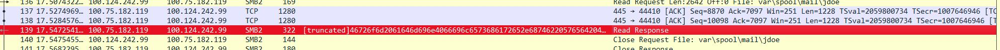
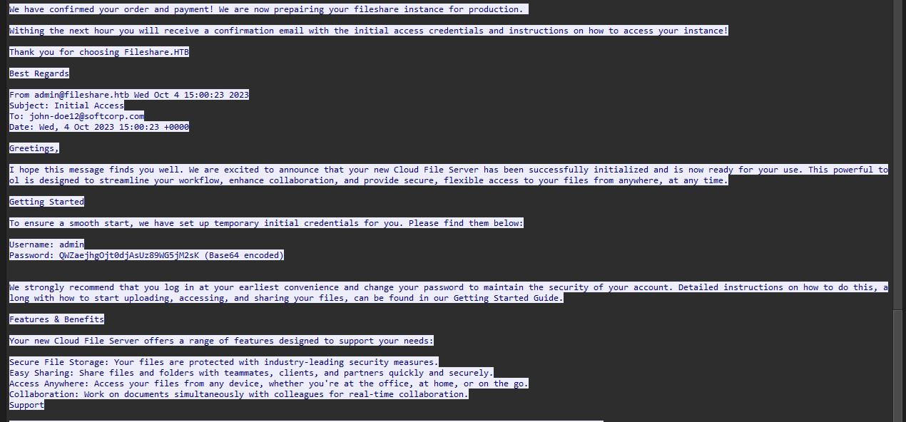
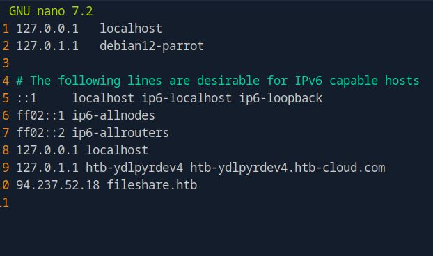
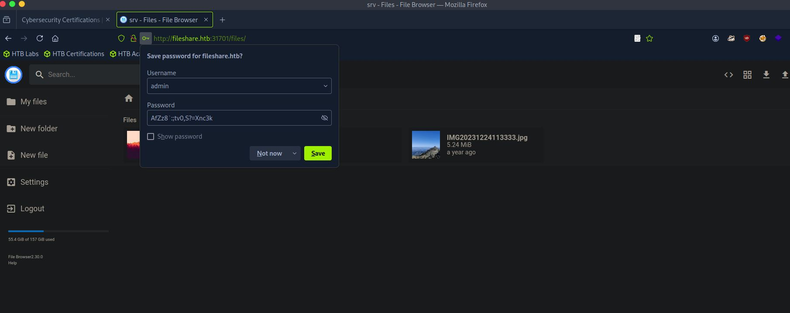

# HTB CTF — Dancing Files
**Category:** Network Forensics  
**Platform:** HackTheBox  
**Date:** April 2025  
**Tools Used:** Wireshark, TCP Stream Analysis, Base64 Decoding, 
DNS Host Configuration  

---

## Overview
This challenge involved analyzing a provided PCAP file to recover
credentials hidden within unencrypted network traffic, then using
those credentials to access a file sharing service and capture the
flag. It demonstrates practical network forensics skills including
packet analysis, protocol inspection, Base64 decoding, and 
credential discovery.

---

## Environment
- Wireshark for PCAP analysis
- Target IP and port provided by HackTheBox
- PCAP file provided containing captured network traffic
- Manual DNS hosts entry configuration required to resolve the
target domain `fileshare.htb`

---

## Methodology

### Step 1 — Initial Reconnaissance
Upon receiving the target IP, port number, and PCAP file I began
by opening the capture in Wireshark. Rather than filtering
immediately I parsed through the packets to get a feel for the
communication patterns and identify anything unusual.

While scrolling through I identified a suspicious
**Read Response** packet highlighted below — it stood out due
to its size and the truncated data visible in the info column.

---

### Step 2 — Following The TCP Stream
I right-clicked the suspicious packet and selected
**Follow → TCP Stream** to reconstruct the full conversation
between the client and server.

This revealed something significant — a full email from
`admin@fileshare.htb` sent to `john-doe12@softcorp.com`
containing initial access credentials for the file sharing
service. The email included:

- **Username:** admin
- **Password:** `QWZaejhgOjt0djAsUz89WG5jM2sK` — marked as
Base64 encoded

---

### Step 3 — Decoding The Password
The password in the email was Base64 encoded. Decoding
`QWZaejhgOjt0djAsUz89WG5jM2sK` revealed the plaintext
credential:

AfZz8`:;tv0,S?=Xnc3k

This is the core vulnerability — even though the password
appeared encoded, Base64 is not encryption. It is trivially
reversible by anyone who captures the traffic.

---

### Step 4 — DNS Configuration
The target service was hosted at `fileshare.htb` — a non-public
domain that does not resolve through standard DNS servers. To
access it I manually added a hosts file entry mapping the domain
to the target IP address using nano:

94.237.52.18    fileshare.htb

This told my machine to bypass DNS entirely and route directly
to the target IP when accessing `fileshare.htb`.

---

### Step 5 — Accessing The Service & Capturing The Flag
Using the recovered credentials I navigated to:

http://fileshare.htb:31701

I authenticated with:
- **Username:** admin
- **Password:** AfZz8`:;tv0,S?=Xnc3k

Successfully logged in and accessed the FileBrowser interface.

After gaining access the flag was located and captured:

HTB{n3v4h_us3_s4mb4_w1th0ut_3ncrypt10n!!}

---

## Key Findings

The flag itself reveals the core vulnerability —
**Samba running without encryption.** The file sharing service
transmitted data including credentials in plaintext over an
unencrypted SMB/Samba connection. Anyone capturing traffic on
the same network had full visibility into the communication
including the account setup email and encoded credentials.

Additionally the use of Base64 encoding gave a false sense of
security — Base64 is an encoding scheme not an encryption
method and is instantly reversible without any key or password.

---

## Mitigation Recommendations
- **Enforce encryption on all file sharing services** — deploy
HTTPS/TLS and require SMB signing and encryption on all
Samba instances
- **Never transmit credentials over unencrypted protocols** —
any traffic visible on the network should be assumed compromised
- **Use actual encryption not encoding** — Base64 provides zero
security. Credentials should be protected with proper encryption
at rest and in transit
- **Place file sharing services behind an HTTPS gateway** —
ensuring all access is encrypted in transit regardless of the
underlying protocol
- **Network segmentation** — restrict file sharing services to
authorized subnets only limiting exposure to packet capture
attacks

---

## What This Demonstrates
- Practical Wireshark usage — navigating and analyzing real
packet captures
- TCP stream reconstruction — following full conversations
across multiple packets
- Credential discovery through network forensics
- Understanding of Base64 encoding vs encryption
- Manual DNS hosts file configuration
- Understanding of unencrypted protocol risks (SMB/Samba)
- CTF methodology — systematic approach to an unknown challenge

---

## Lessons Learned
This challenge reinforced how dangerous unencrypted network
services are in practice. Credentials that appear hidden behind
encoding are completely exposed to anyone capturing network
traffic. It also highlighted how Base64 is commonly
misunderstood as a security measure when it provides none
whatsoever. The skill of identifying suspicious packets in a
noisy capture and knowing when to follow a TCP stream translates
directly to real SOC analyst work.