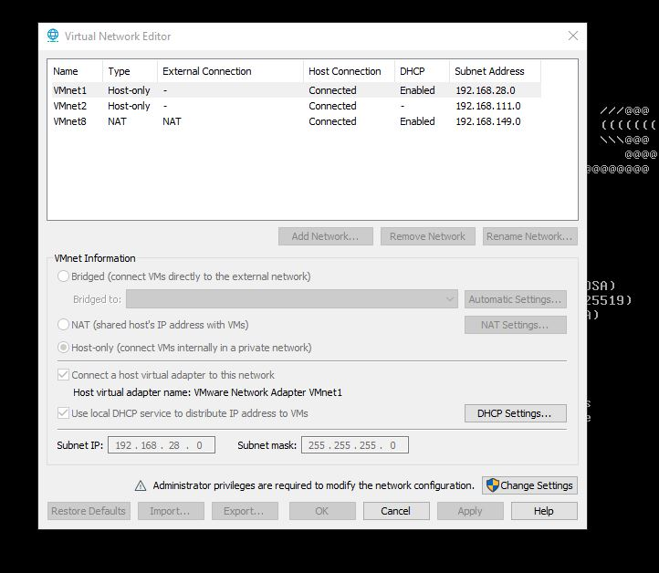
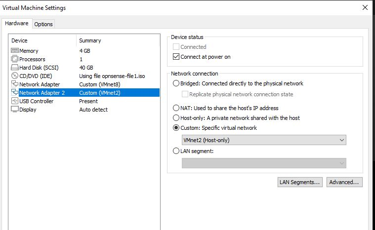
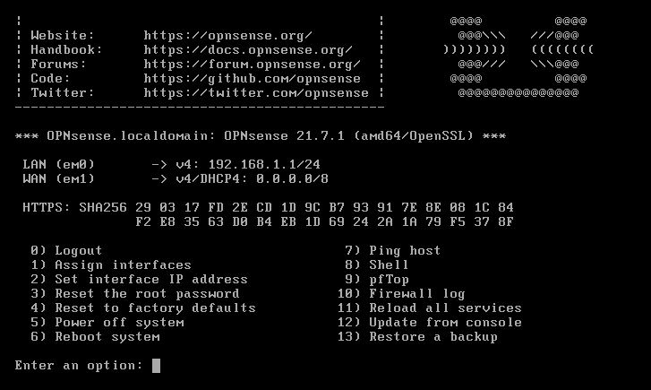
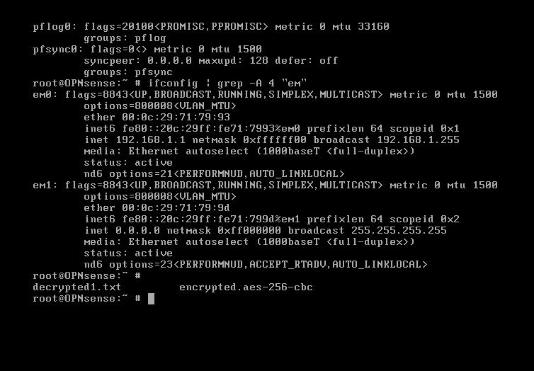
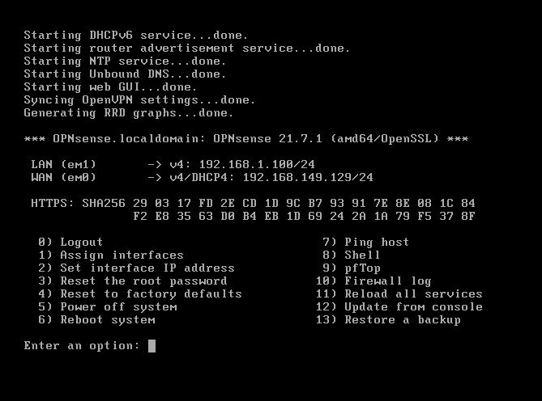
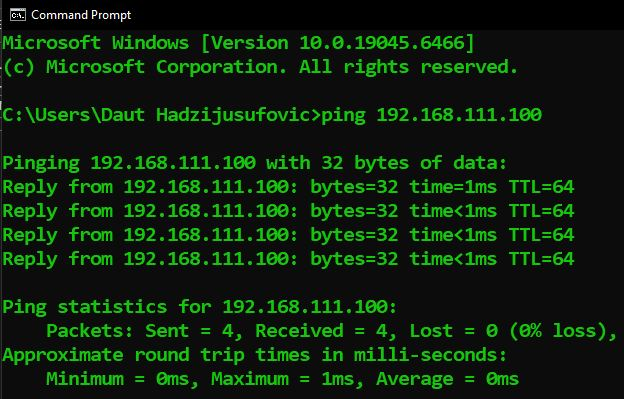

# OPNSense Firewall — Network Security Lab
**Category:** Network Security / Firewall Configuration  
**Platform:** OPNSense 21.7.1 (amd64/OpenSSL)  
**Date:** November 2025  
**Tools Used:** VMware Workstation, OPNSense, ifconfig, ping  

---

> **Quick Navigation**
> - [Jump to Web GUI Configuration](#web-gui-configuration)
> - [Jump to Firewall Rules](#firewall-rules)
> - [Jump to IDS/IPS Configuration](#idsips-configuration)

---

## Overview
In this lab I built a fully functional network firewall from scratch
using OPNSense deployed in VMware Workstation. The goal was to
simulate a real enterprise network environment with a protected
internal LAN, a WAN connection to the internet, and a firewall
controlling all traffic between them.

This lab documents the complete configuration process from initial
VMware network setup through firewall console configuration,
web GUI access, firewall rules, and IDS/IPS deployment using
Suricata.

---

## Network Topology

Internet
│
VMnet8 (NAT) ──── WAN (em0) 192.168.149.129
│
OPNSense Firewall
192.168.111.100
│
VMnet2 (Host-only) ── LAN (em1) 192.168.111.100/24
│
DSL VM (DHCP client)
192.168.111.32-64

---

## Lab Environment

| Component | Details |
|---|---|
| Firewall OS | OPNSense 21.7.1 |
| Hypervisor | VMware Workstation |
| WAN Adapter | VMnet8 (NAT) |
| LAN Adapter | VMnet2 (Host-only) |
| LAN Client | DSL Linux VM |
| RAM | 4GB |
| Storage | 40GB |

---

## Part 1 — VMware Network Configuration

Before booting OPNSense the VMware virtual network adapters
must be configured correctly. This is the foundation everything
else builds on — if the adapters are wrong, the firewall will
not route traffic correctly.

### Step 1 — Virtual Network Editor

I opened VMware Workstation and navigated to
**Edit → Virtual Network Editor** to review the existing
virtual network configuration.



Three VMnets were configured:

| VMnet | Type | Subnet | DHCP | Role |
|---|---|---|---|---|
| VMnet1 | Host-only | 192.168.28.0 | Enabled | Unused |
| VMnet2 | Host-only | 192.168.111.0 | Disabled | LAN |
| VMnet8 | NAT | 192.168.149.0 | Enabled | WAN |

Key points:
- **VMnet8** is the NAT adapter — it shares the host machine's
internet connection with VMs. This becomes the WAN side of
the firewall.
- **VMnet2** is a Host-only adapter with DHCP disabled — this
is our private internal network. DHCP is disabled here because
OPNSense will act as the DHCP server for this subnet, not VMware.

### Step 2 — OPNSense VM Network Adapter Settings

I right-clicked the OPNSense VM in VMware and opened
**Settings** to verify the network adapter assignments.



| Adapter | VMnet | Role |
|---|---|---|
| Network Adapter 1 | VMnet8 (NAT) | WAN interface |
| Network Adapter 2 | VMnet2 (Host-only) | LAN interface |

The VM was also configured with 4GB RAM and a 40GB virtual
disk — sufficient for running OPNSense and all required services.

---

## Part 2 — OPNSense Console Configuration

### Step 3 — Initial Boot (Pre-Configuration)

I powered on the OPNSense VM and allowed it to boot to the
console menu. After a factory reset the firewall booted with
default settings.



Initial state after factory reset:
- **LAN (em0):** `192.168.1.1/24` — default
- **WAN (em1):** `0.0.0.0/8` — no IP assigned

Two problems were immediately visible:
1. The interfaces were reversed — em0 should be WAN and
em1 should be LAN based on our VMware adapter assignments
2. WAN had no IP address because it was mapped to the wrong
adapter

### Step 4 — Identifying The Interface Problem

To confirm the interface reversal I selected **Option 8 — Shell**
from the console menu and ran:

```bash
ifconfig | grep -A 4 "em"
```

This command pipes the full `ifconfig` output through `grep`
to filter and display only the em0 and em1 interfaces with
their 4 lines of configuration detail.



The output confirmed the problem:
- **em0** had `inet 192.168.1.1` — acting as LAN but should
be WAN
- **em1** had `inet 0.0.0.0` — acting as WAN but should be LAN
and was not receiving a DHCP address because it was connected
to VMnet2 which has no DHCP server

I typed `exit` to return to the main console menu.

### Step 5 — Assigning Interfaces Correctly

From the main console menu I selected **Option 1 — Assign
Interfaces** to correct the interface mapping.

Configuration applied:
- **WAN → em0** — connected to VMnet8 (NAT), receives DHCP
from VMware's NAT service
- **LAN → em1** — connected to VMnet2 (Host-only), will be
statically configured

After reassignment all services restarted successfully:



| Service | Status |
|---|---|
| DHCPv6 | ✅ Started |
| Router Advertisement | ✅ Started |
| NTP | ✅ Started |
| Unbound DNS | ✅ Started |
| Web GUI | ✅ Started |
| OpenVPN | ✅ Started |
| RRD Graphs | ✅ Started |

### Step 6 — Identifying The Correct LAN Subnet

Before configuring the LAN static IP I ran `ipconfig` on the
Windows host machine to identify the VMnet2 subnet.


Key information from the host:
- **VMnet2 IPv4 Address:** `192.168.111.10`
- **Subnet Mask:** `255.255.255.0 (/24)`
- **Subnet:** `192.168.111.x`

This confirmed the LAN static IP should be on the
`192.168.111.x` subnet — not the default `192.168.1.x` that
OPNSense assigned after the factory reset.

### Step 7 — Configuring The LAN Static IP and DHCP

From the console menu I selected **Option 2 — Set Interface
IP Address** and configured the LAN interface:

| Setting | Value | Reason |
|---|---|---|
| Interface | LAN (em1) | Private internal network |
| IPv4 via DHCP | No | Static IP required for stable GUI access |
| IPv4 Address | 192.168.111.100 | On VMnet2 subnet, .100 is memorable |
| Subnet Mask | 24 | Matches VMnet2 configuration |
| IPv6 via WAN tracking | No | IPv4 only lab |
| Enable DHCP Server | Yes | Required for DSL VM to get an IP |
| DHCP Start | 192.168.111.32 | Allocates range for LAN clients |
| DHCP End | 192.168.111.64 | Limits scope to known range |
| HTTPS | Yes | Keep encrypted — security best practice |
| Generate New Certificate | Yes | Fresh cert after factory reset |
| Restore Web GUI Defaults | Yes | Ensures GUI is accessible |

After completing the configuration OPNSense restarted services
and confirmed web GUI access:


Final interface state:
- **LAN (em1):** `192.168.111.100/24` ✅
- **WAN (em0):** `192.168.149.129/24` ✅
- **Web GUI:** `https://192.168.111.100` ✅

### Step 8 — Verifying Connectivity

Before accessing the web GUI I verified the host machine could
reach the firewall LAN interface by pinging it from the Windows
command prompt:

ping 192.168.111.100



Successful ping responses confirmed the host machine can
reach the OPNSense LAN interface and the firewall is ready
for web GUI access.

---

## Web GUI Configuration
*Coming soon — DHCP verification, firewall rules, and
IDS/IPS configuration*

---

## Firewall Rules
*Coming soon*

---

## IDS/IPS Configuration
*Coming soon*