# OPNSense Firewall — Network Security Lab
**Category:** Network Security / Firewall Configuration  
**Platform:** OPNSense 21.7.1 (amd64/OpenSSL)  
**Date:** November 2025  
**Tools Used:** VMware Workstation, OPNSense, ifconfig, ping  

---

> **Quick Navigation**
> - [Jump to Web GUI Configuration](#web-gui-configuration)
> - [Jump to Firewall Rules](#firewall-rules)
> - [Jump to IDS/IPS Configuration](#idsips-configuration)

---

## Overview
In this lab I built a fully functional network firewall from scratch
using OPNSense deployed in VMware Workstation. The goal was to
simulate a real enterprise network environment with a protected
internal LAN, a WAN connection to the internet, and a firewall
controlling all traffic between them.

This lab documents the complete configuration process from initial
VMware network setup through firewall console configuration,
web GUI access, firewall rules, and IDS/IPS deployment using
Suricata.

---

## Network Topology

Internet
│
VMnet8 (NAT) ──── WAN (em0) 192.168.149.129
│
OPNSense Firewall
192.168.111.100
│
VMnet2 (Host-only) ── LAN (em1) 192.168.111.100/24
│
DSL VM (DHCP client)
192.168.111.32-64

---

## Lab Environment

| Component | Details |
|---|---|
| Firewall OS | OPNSense 21.7.1 |
| Hypervisor | VMware Workstation |
| WAN Adapter | VMnet8 (NAT) |
| LAN Adapter | VMnet2 (Host-only) |
| LAN Client | DSL Linux VM |
| RAM | 4GB |
| Storage | 40GB |

---

## Part 1 — VMware Network Configuration

Before booting OPNSense the VMware virtual network adapters
must be configured correctly. This is the foundation everything
else builds on — if the adapters are wrong, the firewall will
not route traffic correctly.

### Step 1 — Virtual Network Editor

I opened VMware Workstation and navigated to
**Edit → Virtual Network Editor** to review the existing
virtual network configuration.


Three VMnets were configured:

| VMnet | Type | Subnet | DHCP | Role |
|---|---|---|---|---|
| VMnet1 | Host-only | 192.168.28.0 | Enabled | Unused |
| VMnet2 | Host-only | 192.168.111.0 | Disabled | LAN |
| VMnet8 | NAT | 192.168.149.0 | Enabled | WAN |

Key points:
- **VMnet8** is the NAT adapter — it shares the host machine's
internet connection with VMs. This becomes the WAN side of
the firewall.
- **VMnet2** is a Host-only adapter with DHCP disabled — this
is our private internal network. DHCP is disabled here because
OPNSense will act as the DHCP server for this subnet, not VMware.

### Step 2 — OPNSense VM Network Adapter Settings

I right-clicked the OPNSense VM in VMware and opened
**Settings** to verify the network adapter assignments.


| Adapter | VMnet | Role |
|---|---|---|
| Network Adapter 1 | VMnet8 (NAT) | WAN interface |
| Network Adapter 2 | VMnet2 (Host-only) | LAN interface |

The VM was also configured with 4GB RAM and a 40GB virtual
disk — sufficient for running OPNSense and all required services.

---

## Part 2 — OPNSense Console Configuration

### Step 3 — Initial Boot (Pre-Configuration)

I powered on the OPNSense VM and allowed it to boot to the
console menu. After a factory reset the firewall booted with
default settings.


Initial state after factory reset:
- **LAN (em0):** `192.168.1.1/24` — default
- **WAN (em1):** `0.0.0.0/8` — no IP assigned

Two problems were immediately visible:
1. The interfaces were reversed — em0 should be WAN and
em1 should be LAN based on our VMware adapter assignments
2. WAN had no IP address because it was mapped to the wrong
adapter

### Step 4 — Identifying The Interface Problem

To confirm the interface reversal I selected **Option 8 — Shell**
from the console menu and ran:

```bash
ifconfig | grep -A 4 "em"
```

This command pipes the full `ifconfig` output through `grep`
to filter and display only the em0 and em1 interfaces with
their 4 lines of configuration detail.


The output confirmed the problem:
- **em0** had `inet 192.168.1.1` — acting as LAN but should
be WAN
- **em1** had `inet 0.0.0.0` — acting as WAN but should be LAN
and was not receiving a DHCP address because it was connected
to VMnet2 which has no DHCP server

I typed `exit` to return to the main console menu.

### Step 5 — Assigning Interfaces Correctly

From the main console menu I selected **Option 1 — Assign
Interfaces** to correct the interface mapping.

Configuration applied:
- **WAN → em0** — connected to VMnet8 (NAT), receives DHCP
from VMware's NAT service
- **LAN → em1** — connected to VMnet2 (Host-only), will be
statically configured

After reassignment all services restarted successfully:


| Service | Status |
|---|---|
| DHCPv6 | ✅ Started |
| Router Advertisement | ✅ Started |
| NTP | ✅ Started |
| Unbound DNS | ✅ Started |
| Web GUI | ✅ Started |
| OpenVPN | ✅ Started |
| RRD Graphs | ✅ Started |

### Step 6 — Identifying The Correct LAN Subnet

Before configuring the LAN static IP I ran `ipconfig` on the
Windows host machine to identify the VMnet2 subnet.


Key information from the host:
- **VMnet2 IPv4 Address:** `192.168.111.10`
- **Subnet Mask:** `255.255.255.0 (/24)`
- **Subnet:** `192.168.111.x`

This confirmed the LAN static IP should be on the
`192.168.111.x` subnet — not the default `192.168.1.x` that
OPNSense assigned after the factory reset.

### Step 7 — Configuring The LAN Static IP and DHCP

From the console menu I selected **Option 2 — Set Interface
IP Address** and configured the LAN interface:

| Setting | Value | Reason |
|---|---|---|
| Interface | LAN (em1) | Private internal network |
| IPv4 via DHCP | No | Static IP required for stable GUI access |
| IPv4 Address | 192.168.111.100 | On VMnet2 subnet, .100 is memorable |
| Subnet Mask | 24 | Matches VMnet2 configuration |
| IPv6 via WAN tracking | No | IPv4 only lab |
| Enable DHCP Server | Yes | Required for DSL VM to get an IP |
| DHCP Start | 192.168.111.32 | Allocates range for LAN clients |
| DHCP End | 192.168.111.64 | Limits scope to known range |
| HTTPS | Yes | Keep encrypted — security best practice |
| Generate New Certificate | Yes | Fresh cert after factory reset |
| Restore Web GUI Defaults | Yes | Ensures GUI is accessible |

After completing the configuration OPNSense restarted services
and confirmed web GUI access:


Final interface state:
- **LAN (em1):** `192.168.111.100/24` ✅
- **WAN (em0):** `192.168.149.129/24` ✅
- **Web GUI:** `https://192.168.111.100` ✅

### Step 8 — Verifying Connectivity

Before accessing the web GUI I verified the host machine could
reach the firewall LAN interface by pinging it from the Windows
command prompt:

ping 192.168.111.100


Successful ping responses confirmed the host machine can
reach the OPNSense LAN interface and the firewall is ready
for web GUI access.

---

---

## Part 2 — Web GUI Configuration

> **Quick Navigation**
> - [Jump to Part 1 — Console Configuration](#part-1--vmware-network-configuration)
> - [Jump to Part 3 — Firewall Rules](#part-3--firewall-rules) *(coming soon)*
> - [Jump to Part 4 — IDS/IPS](#part-4--idsips-with-suricata) *(coming soon)*

---

### Step 9 — Accessing The Web GUI

With the firewall fully configured from the console I opened
a browser on the host machine and navigated to:

https://192.168.111.100

After accepting the self-signed certificate warning I logged
in with the default credentials:
- **Username:** root
- **Password:** opnsense

The OPNSense dashboard loaded confirming web GUI access
was working correctly.


The dashboard confirmed:
- **Hostname:** OPNsense.localdomain
- **Version:** OPNSense 21.7.1-amd64
- **WAN Gateway:** `192.168.149.2` — Online ✅
- **LAN:** `192.168.111.100` — Up ✅
- **CPU Usage:** 14%
- **Memory:** 6% of 4GB used
- All core services running

---

### Step 10 — WAN Interface Configuration

I navigated to **Interfaces → WAN** and unchecked two
settings that would otherwise block VMware NAT traffic
from passing through the firewall:

- ☐ **Block private networks** — unchecked
- ☐ **Block bogon networks** — unchecked


These settings exist to protect real-world firewalls from
receiving traffic from private IP ranges on the WAN side.
In a VMware lab environment the WAN uses a private NAT
subnet so these must be disabled for traffic to flow
correctly between the LAN and internet.

---

### Step 11 — Dashboard Widget Configuration

I customized the dashboard to display security relevant
information at a glance by adding the following widgets:

- **Traffic Graph** — live bandwidth monitoring on WAN and LAN
- **Firewall Log** — real time display of allowed and blocked connections
- **Gateways** — WAN gateway status and latency
- **Interfaces** — interface status and IP addresses
- **System Log** — system events and configuration changes


The dashboard immediately surfaced useful information:
- Live traffic graphs showing inbound and outbound bandwidth
- Firewall log entries showing NTP traffic (port 123) being passed
- Both WAN gateways showing **Online** status
- LAN at `192.168.111.100` and WAN at `192.168.149.129` both up

---

### Step 12 — DHCP Server Verification & Configuration

I navigated to **Services → DHCPv4 → LAN** to verify and
correct the DHCP configuration. I identified that the DNS
server and Gateway fields were empty and needed to be
configured to point to the firewall LAN IP.


Final verified configuration:

| Setting | Value |
|---|---|
| Enable | ✅ Enabled |
| Subnet | 192.168.111.0 |
| Subnet Mask | 255.255.255.0 |
| Range Start | 192.168.111.32 |
| Range End | 192.168.111.64 |
| DNS Server | 192.168.111.100 |
| Gateway | 192.168.111.100 |

Setting both the DNS server and Gateway to the firewall
LAN IP `192.168.111.100` ensures any device connecting
to the LAN uses OPNSense as both its DNS resolver and
its default gateway for internet routing.

---

### Step 13 — General Settings & DNS Configuration

I navigated to **System → Settings → General** to configure
the firewall hostname, timezone, and upstream DNS server.


Settings configured:
- **Hostname:** OPNsense
- **Domain:** localdomain
- **Timezone:** America/New_York
- **DNS Server:** `8.8.8.8` (Google DNS) via WAN_DHCP gateway

Adding Google DNS as the upstream resolver ensures OPNSense
can forward DNS queries it cannot resolve locally out to
the internet for resolution.

**Note on DNS Service Selection:**
During configuration I initially attempted to use Unbound DNS
as the resolver. However Unbound failed to start consistently
in this OPNSense 21.7.1 environment. After troubleshooting
I identified the conflict and switched to Dnsmasq — a
lightweight DNS forwarder that is more reliable in virtualized
lab environments. Dnsmasq forwards DNS requests from LAN
clients directly to the upstream Google DNS server at `8.8.8.8`
rather than attempting full recursive resolution. This resolved
the issue and DNS worked correctly for all subsequent tests.

---

### Step 14 — Enabling SSH

I navigated to **System → Settings → Administration** and
enabled SSH access to the firewall for remote management
and future lab exercises.


Settings enabled:
- ✅ Enable Secure Shell
- ✅ Permit root user login
- ✅ Permit password login

**Note:** Enabling root remote access is not recommended
in production environments. In this lab it is enabled for
convenience and future exercises. In a real deployment
certificate based authentication would replace password
login as a security best practice.

---

### Step 15 — DNS Resolution Testing

I navigated to **Interfaces → Diagnostics → DNS Lookup**
and tested resolution of `www.google.com` to verify the
upstream DNS configuration was working correctly from
the firewall itself.


The lookup returned multiple valid IP addresses for
`www.google.com` confirming OPNSense can successfully
forward DNS queries to `8.8.8.8` and return results
to clients on the LAN.

---

### Step 16 — DSL VM Network Configuration

Before booting the DSL VM I verified its VMware network
adapter was set to **VMnet2** — the same Host-only network
as the OPNSense LAN interface.


This ensures the DSL VM connects to the OPNSense LAN
and receives a DHCP address from the firewall rather
than from any other DHCP service.

---

### Step 17 — DSL VM DHCP Verification

After booting the DSL VM I opened a terminal and ran
`ifconfig` to verify it received an IP address from
the OPNSense DHCP server.


The DSL VM was assigned:
- **IP Address:** `192.168.111.33`
- **Subnet Mask:** `255.255.255.0`
- **Broadcast:** `192.168.111.255`

`192.168.111.33` falls within the configured DHCP range
of `.32` to `.64` confirming the OPNSense DHCP server
is functioning correctly and issuing addresses to LAN
clients as expected.

---

### Step 18 — End-to-End Connectivity Verification

With the DSL VM connected I ran a series of tests to
verify full end-to-end connectivity through the firewall.

**Test 1 — Ping OPNSense LAN Interface:**


Successful ping to `192.168.111.100` confirms the DSL VM
can reach the OPNSense firewall over the LAN.

**Test 2 — Ping Internet:**


Successful ping to `8.8.8.8` confirms traffic is routing
correctly through OPNSense from the LAN to the internet.

**Test 3 — DNS Resolution:**


Successful DNS resolution for both `8.8.8.8` and
`www.google.com` using OPNSense as the DNS server at
`192.168.111.100`. Multiple valid IP addresses returned
for `www.google.com` confirming full DNS resolution
is working end to end through the firewall.

---

## Part 2 — Summary

| Task | Status |
|---|---|
| Web GUI Access | ✅ Complete |
| WAN Interface Settings | ✅ Complete |
| Dashboard Widgets | ✅ Complete |
| DHCP Verification & Fix | ✅ Complete |
| General Settings & DNS | ✅ Complete |
| SSH Enabled | ✅ Complete |
| DNS Resolution Test | ✅ Complete |
| DSL VM Connected | ✅ Complete |
| DHCP Verified on Client | ✅ Complete |
| End-to-End Connectivity | ✅ Complete |

The firewall is now fully configured and operational.
The LAN network is protected, DHCP is serving clients
correctly, DNS is resolving through OPNSense, and traffic
is routing from the private LAN through the firewall to
the internet.

---

---

## Part 3 — Firewall Rules & Traffic Control

> **Quick Navigation**
> - [Jump to Part 1 — Console Configuration](#part-1--vmware-network-configuration)
> - [Jump to Part 2 — Web GUI Configuration](#part-2--web-gui-configuration)
> - [Jump to Part 4 — IDS/IPS](#part-4--idsips-with-suricata) *(coming soon)*

---

### Understanding Default Firewall Rules

Before creating any custom rules I reviewed the default rule
configuration that OPNSense ships with out of the box.

**LAN Rules — Default State:**

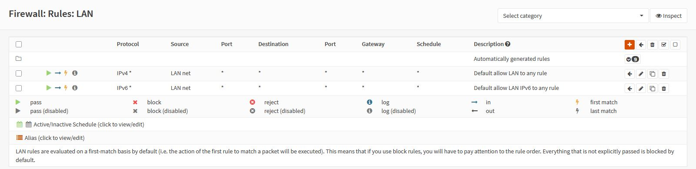

Two default rules exist on the LAN interface:
- **Default allow LAN to any rule (IPv4)** — allows any LAN
device to reach anywhere on the internet over any protocol
- **Default allow LAN IPv6 to any rule** — same for IPv6 traffic

**WAN Rules — Default State:**

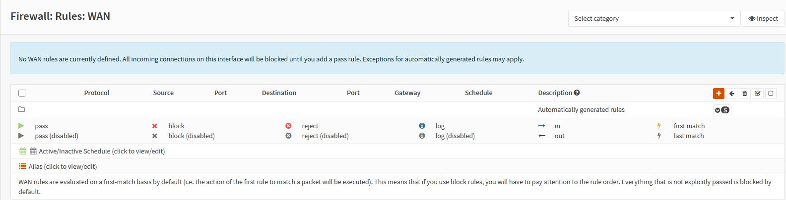

No rules exist on the WAN interface by default. OPNSense
displays a clear message: "All incoming connections on this
interface will be blocked until you add a pass rule." This is
the correct and secure default posture — nothing from the
internet can reach inside the network unless explicitly allowed.

**Critical Concept — Rule Order:**
OPNSense evaluates rules top to bottom on a first-match basis.
The first rule that matches a packet stops evaluation. This
means block rules must be placed **above** allow rules or they
will never trigger — the allow rule will match first and permit
the traffic regardless of any block rules below it.

---

### Step 19 — Creating Aliases

Before writing firewall rules I created aliases — named groups
of IPs or ports that make rules readable, maintainable, and
easy to update. Instead of hardcoding IP addresses into rules,
aliases allow a single update to automatically apply across
all rules that reference them.

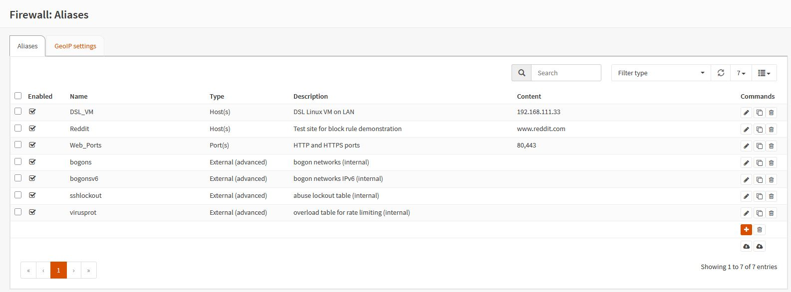

Three aliases were created:

| Alias | Type | Value | Purpose |
|---|---|---|---|
| DSL_VM | Host(s) | 192.168.111.33 | DSL Linux VM on LAN |
| Web_Ports | Port(s) | 80, 443 | HTTP and HTTPS ports |
| Reddit | Host(s) | www.reddit.com | Test site for block rule |

Using aliases rather than raw IP addresses is considered best
practice in enterprise environments. When a server changes IP
addresses, updating the alias automatically updates every rule
that references it — no need to hunt through individual rules.

---

### Step 20 — Creating A Block Rule

To demonstrate firewall rule creation and traffic control I
created a rule to block HTTP access to Reddit from all LAN
clients. This simulates a real-world content filtering scenario
common in enterprise and legal environments.

**Rule Configuration:**

| Field | Value |
|---|---|
| Action | Block |
| Interface | LAN |
| Direction | In |
| TCP/IP Version | IPv4 |
| Protocol | TCP |
| Source | LAN net |
| Destination | Reddit (alias) |
| Destination Port | 80 (HTTP) |
| Log | ✅ Enabled |
| Description | Block HTTP access to Reddit |

After saving the rule I verified it was positioned **above** the
default allow rule — a critical step. If the block rule is below
the allow rule it will never trigger because the allow rule
matches first.

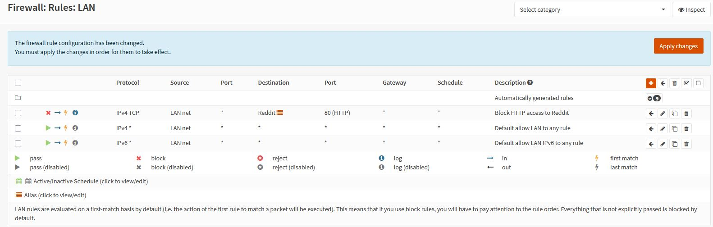

Rule order after configuration:

1.Block HTTP access to Reddit  ← evaluated first
2.Default allow LAN to any rule
3.Default allow LAN IPv6 to any rule

---

### Step 21 — Testing The Block Rule

With the rule in place I opened Firefox on the DSL VM and
attempted to navigate to `http://www.reddit.com`.

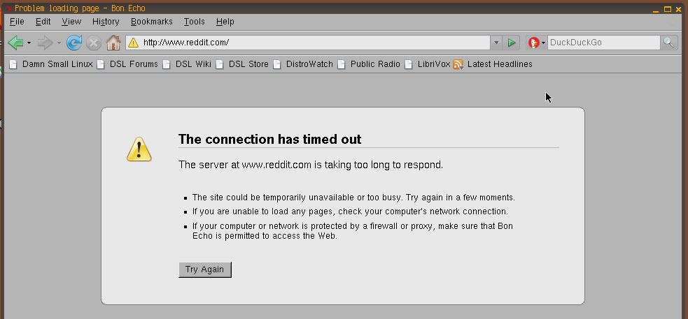

The page failed to load — the DSL browser showed its default
cached homepage instead of Reddit, confirming the firewall
was dropping the connection. This behavior is characteristic
of a **Block** action — the firewall silently drops packets
with no response sent back to the client. The browser
connection simply hangs and eventually times out.

This is distinct from a **Reject** action which actively sends
a connection refused message back to the client, causing the
browser to display an error immediately rather than hanging.

---

### Step 22 — Firewall Log Analysis

To verify the rule was firing correctly I navigated to
**Firewall → Log Files → Live View** and filtered by
destination port 80.

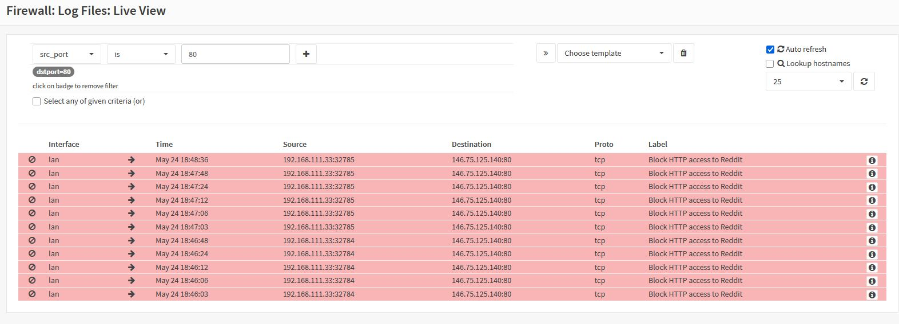

The logs confirmed the block rule was working exactly as
intended. Every entry showed:

| Field | Value | Meaning |
|---|---|---|
| Interface | lan | Traffic from LAN interface |
| Source | 192.168.111.33 | DSL VM attempting connection |
| Destination | 146.75.125.140:80 | Reddit's IP on HTTP port |
| Protocol | tcp | TCP connection attempt |
| Label | Block HTTP access to Reddit | Our rule firing |
| Color | Red | Blocked traffic |

Multiple timestamps showed the DSL browser repeatedly
retrying the connection — each attempt blocked by the
firewall rule. This is exactly the kind of log analysis a SOC
analyst performs to verify security controls are functioning
and to investigate suspicious traffic patterns.

Reading firewall logs is a fundamental SOC skill. The ability
to correlate log entries with specific rules, identify source
and destination hosts, and confirm whether traffic was
permitted or denied forms the basis of network security
monitoring.

---

### Step 23 — Block vs Reject Investigation

After confirming the block rule was working I modified the action
from **Block** to **Reject** to demonstrate the behavioral
difference between the two actions.

**Block vs Reject — Key Difference:**
- **Block** — firewall silently drops packets. The connection
hangs indefinitely with no response sent back to the client.
- **Reject** — firewall actively sends a "Connection Refused"
message back to the client. The connection fails immediately.

**Testing revealed three important firewall concepts:**

**Finding 1 — Port 80 alone is insufficient to block modern sites**


Running `wget -T 5 http://www.reddit.com` showed the connection
still reaching Reddit's server:

Connecting to www.reddit.com[146.75.125.140]:80... connected.
HTTP request sent, awaiting response... 301 Moved Permanently
Location: https://www.reddit.com/ [following]

Reddit accepted the port 80 connection just long enough to
send a 301 redirect to HTTPS. Our rule only covered port 80
so the initial connection succeeded before the redirect. This
demonstrated that blocking only HTTP is insufficient for modern
websites that redirect to HTTPS.

**Fix:** Updated the rule to use the `Web_Ports` alias covering
both port 80 (HTTP) and port 443 (HTTPS).

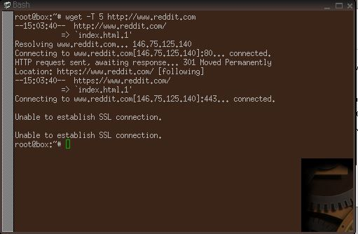

**Finding 2 — TCP rules don't block ICMP**

Running `ping -c 4 146.75.125.140` showed successful ping
responses despite the block rule being active. This is because
our rule specifies `Protocol: TCP` — ping uses ICMP which is
a completely different protocol and bypasses TCP-specific rules.

This demonstrates the importance of protocol specificity when
writing firewall rules. A rule targeting TCP traffic has no
effect on ICMP, UDP, or other protocols.

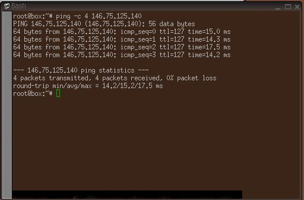

**Finding 3 — Reject confirmed working on port 443**

Running `telnet 146.75.125.140 443` with the rule set to
Reject produced:

Trying 146.75.125.140...
telnet: Unable to connect to remote host: Connection refused

The immediate "Connection refused" response confirmed the
Reject action was working correctly on port 443. This is the
definitive proof of the Reject behavior — the firewall actively
refused the connection rather than silently dropping it.

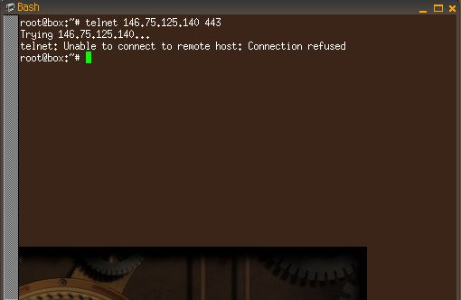

**Final Rule Configuration:**

After completing the investigation the rule was updated and
set back to Block — the preferred action in production
environments since it reveals less information to potential
attackers about the firewall's rule set.

| Field | Value |
|---|---|
| Action | Block |
| Destination | Reddit (alias) |
| Destination Port | Web_Ports (80 & 443) |
| Description | Block HTTP and HTTPS access to Reddit |

---

### Step 24 — FTP Rule

I created a firewall rule to explicitly allow FTP traffic from
the LAN to the WAN.

**Rule Configuration:**

| Field | Value |
|---|---|
| Action | Pass |
| Interface | LAN |
| Direction | In |
| TCP/IP Version | IPv4 |
| Protocol | TCP |
| Source | LAN net |
| Destination | Any |
| Destination Port | FTP (21) |
| Log | ✅ Enabled |
| Description | Allow FTP from LAN to WAN |

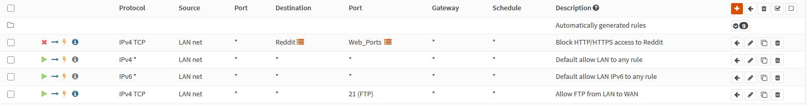

**Testing FTP Connectivity:**

I connected to the Southwest Florida Water Management District
public FTP server to verify FTP traffic was passing through
the firewall correctly.

```bash
ftp ftp.swfwmd.state.fl.us
```

After authenticating with anonymous credentials I switched to
passive mode and retrieved a directory listing confirming a
successful FTP session through the firewall.

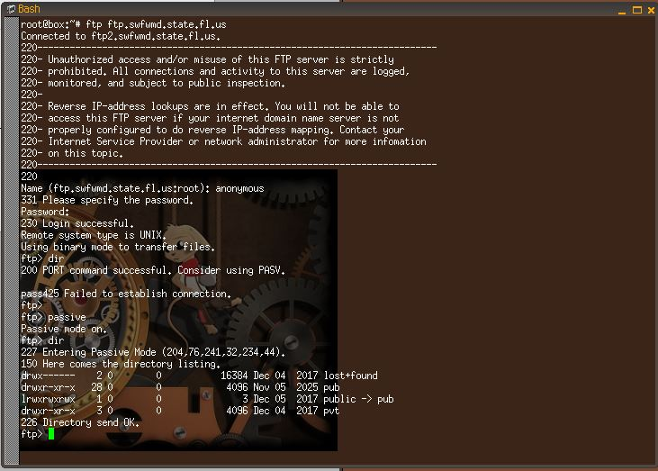

The session confirmed:
- Connection established to external FTP server ✅
- Anonymous authentication successful ✅
- Passive mode working correctly ✅
- Directory listing received ✅

---

### Step 25 — Telnet Rule

I created a firewall rule to allow Telnet traffic from the
LAN to the WAN. Following the textbook convention this rule
was named "Game of Chess" referencing the FreeChess.org
test server used to verify connectivity.

**Rule Configuration:**

| Field | Value |
|---|---|
| Action | Pass |
| Interface | LAN |
| Direction | In |
| TCP/IP Version | IPv4 |
| Protocol | TCP |
| Source | LAN net |
| Destination | Any |
| Destination Port | 23 (Telnet) |
| Log | ✅ Enabled |
| Description | Game of Chess |

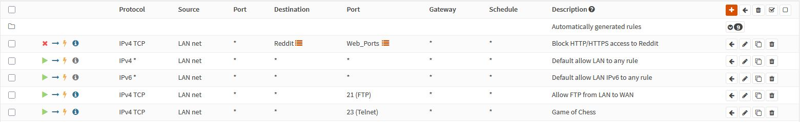

**Testing Telnet Connectivity:**

I connected to the Free Internet Chess Server at
`54.39.129.129` to verify Telnet traffic was passing through
the firewall correctly.

```bash
telnet 54.39.129.129
```

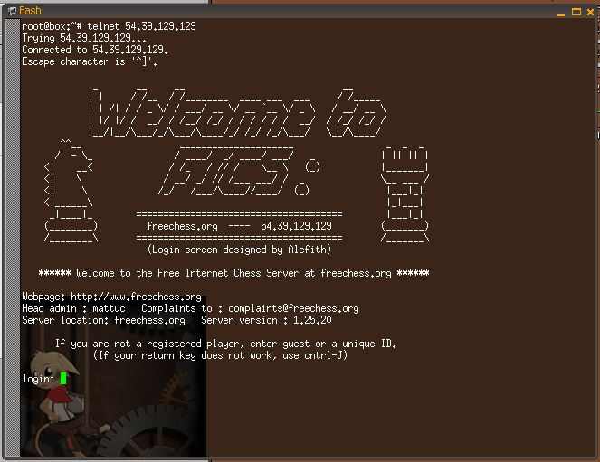

The FreeChess.org ASCII banner loaded successfully confirming
Telnet traffic on port 23 is routing through OPNSense correctly.

---

### Understanding Rule Purpose — Default Allow vs Default Deny

An important observation from this lab — the FTP and Telnet
rules were created as part of a structured learning exercise
to demonstrate explicit rule creation and protocol-specific
traffic control.

In this lab environment the default LAN rule "Default allow
LAN to any rule" permits all outbound traffic from the LAN
to the internet. This means FTP and Telnet traffic would pass
through the firewall even without these specific rules.

However in a **production environment** running a proper
**default-deny security posture** these explicit rules become
essential. A default-deny configuration works as follows:

1.Delete the "Default allow LAN to any rule"
2.Block all outbound traffic by default
3.Create explicit allow rules only for approved protocols
4.Log everything for monitoring and auditing

This is how real enterprise firewalls are configured — block
everything, allow only what is explicitly needed, and log all
traffic for security monitoring. The FTP and Telnet rules
created in this lab demonstrate exactly the kind of explicit
protocol-specific rules that would be required in a
default-deny environment.

Additionally creating protocol-specific rules with logging
enabled — even when a default allow rule exists — allows
security teams to monitor and audit specific protocols of
interest without changing the overall traffic policy.

---

### Step 26 — NAT Port Forwarding

NAT (Network Address Translation) Port Forwarding allows
external clients to access internal services through the
firewall. In this configuration I exposed the DSL VM's
Monkey Web server to the WAN interface — simulating a
real enterprise scenario where an internal web server is
made accessible from outside the network.

**How NAT Port Forwarding Works:**

External client → OPNSense WAN IP:8080
↓
OPNSense NAT rule
↓
DSL VM (192.168.111.33):80

Any connection arriving at the firewall WAN on port 8080
gets forwarded internally to the DSL VM on port 80.

**Step 1 — Enable Monkey Web Server on DSL VM**

The DSL VM runs a lightweight web server called Monkey Web.
It is not enabled by default and must be started manually
through the DSL Control Panel.

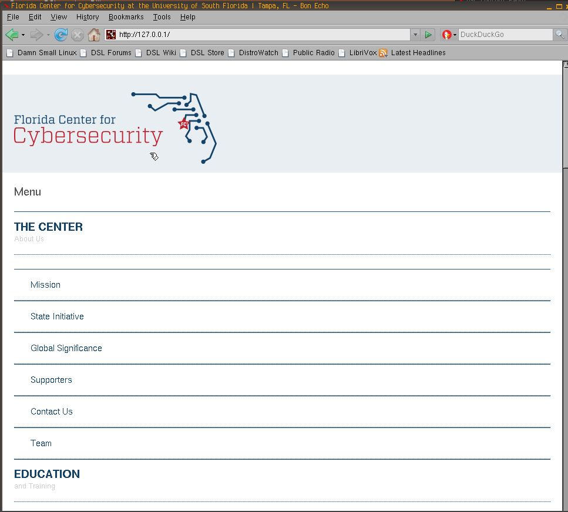

After starting Monkey Web I verified it was serving content
by navigating to `http://127.0.0.1` on the DSL VM — the
Florida Center for Cybersecurity page loaded confirming the
web server was running correctly on port 80.

**Step 2 — Configure NAT Port Forward Rule**

I navigated to **Firewall → NAT → Port Forward** and
created a new forwarding rule:

| Field | Value |
|---|---|
| Interface | WAN |
| Protocol | TCP |
| Destination | WAN address |
| Destination Port | 8080 |
| Redirect Target IP | DSL_VM (alias) |
| Redirect Target Port | 80 (HTTP) |
| Description | Forward WAN 8080 to DSL Web Server |

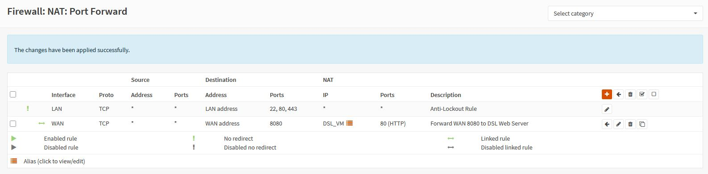

OPNSense automatically generated an associated WAN firewall
rule to allow inbound traffic on port 8080 when the NAT
rule was created.

**Step 3 — Route Configuration**

Testing revealed a common VMware NAT environment issue —
the Windows host was attempting to connect directly to the
DSL VM bypassing the firewall entirely. This occurs because
the VMnet8 interface on the host has no gateway configured
and is set to "On-Link" causing traffic to circumvent
OPNSense.

The textbook documents this as a known VMware virtualization
limitation. When the host VMnet8 adapter has no gateway
the browser connects directly from the VMnet8 interface
to the DSL server on VMnet2 — a Host-Only network that
cannot be traversed directly from VMnet8.

The solution requires adding a Windows route to force
traffic through the OPNSense firewall as the gateway:

```bash
# Check current WAN subnet route
route print 192.168.149.0

# Delete the On-Link route
route delete 192.168.149.0

# Add new route with OPNSense as gateway
route add 192.168.149.0 mask 255.255.255.0 192.168.149.129 metric 1 if <interface-ID>
```

**Note:** Modifying Windows routes in a VMware environment
requires care — removing routes can temporarily disconnect
access to the OPNSense web GUI until routes are restored.
Routes can be reset using `route -f` followed by
`ipconfig /release` and `ipconfig /renew` to restore
VMware's default adapter routes.

This NAT port forwarding configuration will be fully tested
and verified in the next session after resolving the route
configuration in the VMware environment.

---

## Part 3 — In Progress

| Task | Status |
|---|---|
| Default rules review | ✅ Complete |
| Aliases configuration | ✅ Complete |
| Block rule creation & testing | ✅ Complete |
| Firewall log analysis | ✅ Complete |
| Block vs Reject investigation | ✅ Complete |
| FTP rule | ✅ Complete |
| Telnet rule | ✅ Complete |
| NAT port forwarding | 🔄 In Progress |
| Traffic shaping | ⏳ Pending |

---

## Part 4 — IDS/IPS with Suricata
*Coming soon*