# OPNSense Firewall — Network Security Lab
**Category:** Network Security / Firewall Configuration  
**Platform:** OPNSense 21.7.1 (amd64/OpenSSL)  
**Date:** November 2025  
**Tools Used:** VMware Workstation, OPNSense, ifconfig, ping  

---

> **Quick Navigation**
> - [Jump to Web GUI Configuration](#web-gui-configuration)
> - [Jump to Firewall Rules](#firewall-rules)
> - [Jump to IDS/IPS Configuration](#idsips-configuration)

---

## Overview
In this lab I built a fully functional network firewall from scratch
using OPNSense deployed in VMware Workstation. The goal was to
simulate a real enterprise network environment with a protected
internal LAN, a WAN connection to the internet, and a firewall
controlling all traffic between them.

This lab documents the complete configuration process from initial
VMware network setup through firewall console configuration,
web GUI access, firewall rules, and IDS/IPS deployment using
Suricata.

---

## Network Topology

Internet
│
VMnet8 (NAT) ──── WAN (em0) 192.168.149.129
│
OPNSense Firewall
192.168.111.100
│
VMnet2 (Host-only) ── LAN (em1) 192.168.111.100/24
│
DSL VM (DHCP client)
192.168.111.32-64

---

## Lab Environment

| Component | Details |
|---|---|
| Firewall OS | OPNSense 21.7.1 |
| Hypervisor | VMware Workstation |
| WAN Adapter | VMnet8 (NAT) |
| LAN Adapter | VMnet2 (Host-only) |
| LAN Client | DSL Linux VM |
| RAM | 4GB |
| Storage | 40GB |

---

## Part 1 — VMware Network Configuration

Before booting OPNSense the VMware virtual network adapters
must be configured correctly. This is the foundation everything
else builds on — if the adapters are wrong, the firewall will
not route traffic correctly.

### Step 1 — Virtual Network Editor

I opened VMware Workstation and navigated to
**Edit → Virtual Network Editor** to review the existing
virtual network configuration.


Three VMnets were configured:

| VMnet | Type | Subnet | DHCP | Role |
|---|---|---|---|---|
| VMnet1 | Host-only | 192.168.28.0 | Enabled | Unused |
| VMnet2 | Host-only | 192.168.111.0 | Disabled | LAN |
| VMnet8 | NAT | 192.168.149.0 | Enabled | WAN |

Key points:
- **VMnet8** is the NAT adapter — it shares the host machine's
internet connection with VMs. This becomes the WAN side of
the firewall.
- **VMnet2** is a Host-only adapter with DHCP disabled — this
is our private internal network. DHCP is disabled here because
OPNSense will act as the DHCP server for this subnet, not VMware.

### Step 2 — OPNSense VM Network Adapter Settings

I right-clicked the OPNSense VM in VMware and opened
**Settings** to verify the network adapter assignments.


| Adapter | VMnet | Role |
|---|---|---|
| Network Adapter 1 | VMnet8 (NAT) | WAN interface |
| Network Adapter 2 | VMnet2 (Host-only) | LAN interface |

The VM was also configured with 4GB RAM and a 40GB virtual
disk — sufficient for running OPNSense and all required services.

---

## Part 2 — OPNSense Console Configuration

### Step 3 — Initial Boot (Pre-Configuration)

I powered on the OPNSense VM and allowed it to boot to the
console menu. After a factory reset the firewall booted with
default settings.


Initial state after factory reset:
- **LAN (em0):** `192.168.1.1/24` — default
- **WAN (em1):** `0.0.0.0/8` — no IP assigned

Two problems were immediately visible:
1. The interfaces were reversed — em0 should be WAN and
em1 should be LAN based on our VMware adapter assignments
2. WAN had no IP address because it was mapped to the wrong
adapter

### Step 4 — Identifying The Interface Problem

To confirm the interface reversal I selected **Option 8 — Shell**
from the console menu and ran:

```bash
ifconfig | grep -A 4 "em"
```

This command pipes the full `ifconfig` output through `grep`
to filter and display only the em0 and em1 interfaces with
their 4 lines of configuration detail.


The output confirmed the problem:
- **em0** had `inet 192.168.1.1` — acting as LAN but should
be WAN
- **em1** had `inet 0.0.0.0` — acting as WAN but should be LAN
and was not receiving a DHCP address because it was connected
to VMnet2 which has no DHCP server

I typed `exit` to return to the main console menu.

### Step 5 — Assigning Interfaces Correctly

From the main console menu I selected **Option 1 — Assign
Interfaces** to correct the interface mapping.

Configuration applied:
- **WAN → em0** — connected to VMnet8 (NAT), receives DHCP
from VMware's NAT service
- **LAN → em1** — connected to VMnet2 (Host-only), will be
statically configured

After reassignment all services restarted successfully:


| Service | Status |
|---|---|
| DHCPv6 | ✅ Started |
| Router Advertisement | ✅ Started |
| NTP | ✅ Started |
| Unbound DNS | ✅ Started |
| Web GUI | ✅ Started |
| OpenVPN | ✅ Started |
| RRD Graphs | ✅ Started |

### Step 6 — Identifying The Correct LAN Subnet

Before configuring the LAN static IP I ran `ipconfig` on the
Windows host machine to identify the VMnet2 subnet.

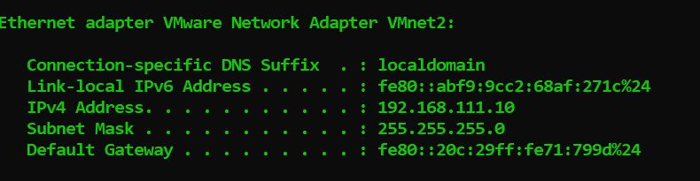

Key information from the host:
- **VMnet2 IPv4 Address:** `192.168.111.10`
- **Subnet Mask:** `255.255.255.0 (/24)`
- **Subnet:** `192.168.111.x`

This confirmed the LAN static IP should be on the
`192.168.111.x` subnet — not the default `192.168.1.x` that
OPNSense assigned after the factory reset.

### Step 7 — Configuring The LAN Static IP and DHCP

From the console menu I selected **Option 2 — Set Interface
IP Address** and configured the LAN interface:

| Setting | Value | Reason |
|---|---|---|
| Interface | LAN (em1) | Private internal network |
| IPv4 via DHCP | No | Static IP required for stable GUI access |
| IPv4 Address | 192.168.111.100 | On VMnet2 subnet, .100 is memorable |
| Subnet Mask | 24 | Matches VMnet2 configuration |
| IPv6 via WAN tracking | No | IPv4 only lab |
| Enable DHCP Server | Yes | Required for DSL VM to get an IP |
| DHCP Start | 192.168.111.32 | Allocates range for LAN clients |
| DHCP End | 192.168.111.64 | Limits scope to known range |
| HTTPS | Yes | Keep encrypted — security best practice |
| Generate New Certificate | Yes | Fresh cert after factory reset |
| Restore Web GUI Defaults | Yes | Ensures GUI is accessible |

After completing the configuration OPNSense restarted services
and confirmed web GUI access:

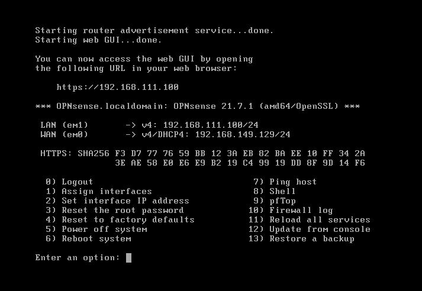

Final interface state:
- **LAN (em1):** `192.168.111.100/24` ✅
- **WAN (em0):** `192.168.149.129/24` ✅
- **Web GUI:** `https://192.168.111.100` ✅

### Step 8 — Verifying Connectivity

Before accessing the web GUI I verified the host machine could
reach the firewall LAN interface by pinging it from the Windows
command prompt:

ping 192.168.111.100


Successful ping responses confirmed the host machine can
reach the OPNSense LAN interface and the firewall is ready
for web GUI access.

---

---

## Part 2 — Web GUI Configuration

> **Quick Navigation**
> - [Jump to Part 1 — Console Configuration](#part-1--vmware-network-configuration)
> - [Jump to Part 3 — Firewall Rules](#part-3--firewall-rules) *(coming soon)*
> - [Jump to Part 4 — IDS/IPS](#part-4--idsips-with-suricata) *(coming soon)*

---

### Step 9 — Accessing The Web GUI

With the firewall fully configured from the console I opened
a browser on the host machine and navigated to:

https://192.168.111.100

After accepting the self-signed certificate warning I logged
in with the default credentials:
- **Username:** root
- **Password:** opnsense

The OPNSense dashboard loaded confirming web GUI access
was working correctly.

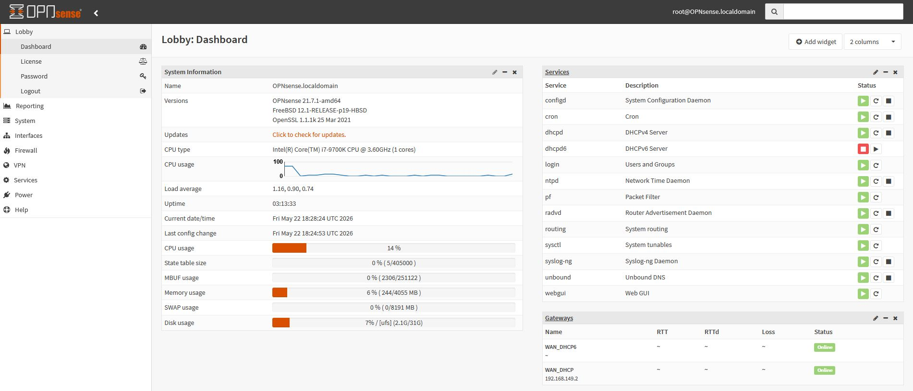

The dashboard confirmed:
- **Hostname:** OPNsense.localdomain
- **Version:** OPNSense 21.7.1-amd64
- **WAN Gateway:** `192.168.149.2` — Online ✅
- **LAN:** `192.168.111.100` — Up ✅
- **CPU Usage:** 14%
- **Memory:** 6% of 4GB used
- All core services running

---

### Step 10 — WAN Interface Configuration

I navigated to **Interfaces → WAN** and unchecked two
settings that would otherwise block VMware NAT traffic
from passing through the firewall:

- ☐ **Block private networks** — unchecked
- ☐ **Block bogon networks** — unchecked

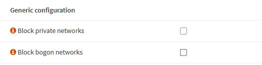

These settings exist to protect real-world firewalls from
receiving traffic from private IP ranges on the WAN side.
In a VMware lab environment the WAN uses a private NAT
subnet so these must be disabled for traffic to flow
correctly between the LAN and internet.

---

### Step 11 — Dashboard Widget Configuration

I customized the dashboard to display security relevant
information at a glance by adding the following widgets:

- **Traffic Graph** — live bandwidth monitoring on WAN and LAN
- **Firewall Log** — real time display of allowed and blocked connections
- **Gateways** — WAN gateway status and latency
- **Interfaces** — interface status and IP addresses
- **System Log** — system events and configuration changes

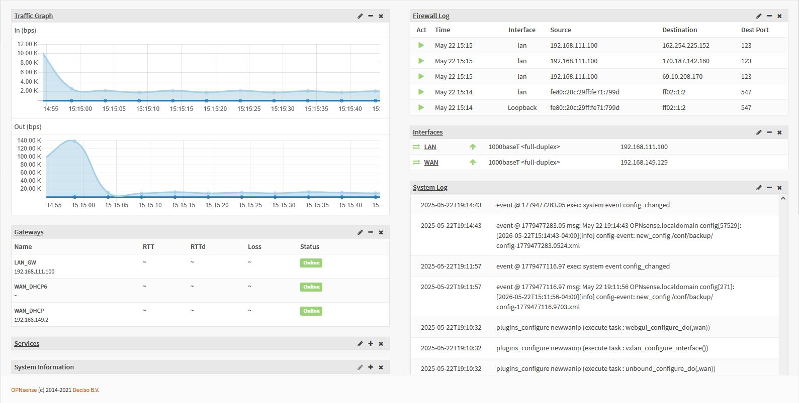

The dashboard immediately surfaced useful information:
- Live traffic graphs showing inbound and outbound bandwidth
- Firewall log entries showing NTP traffic (port 123) being passed
- Both WAN gateways showing **Online** status
- LAN at `192.168.111.100` and WAN at `192.168.149.129` both up

---

### Step 12 — DHCP Server Verification & Configuration

I navigated to **Services → DHCPv4 → LAN** to verify and
correct the DHCP configuration. I identified that the DNS
server and Gateway fields were empty and needed to be
configured to point to the firewall LAN IP.

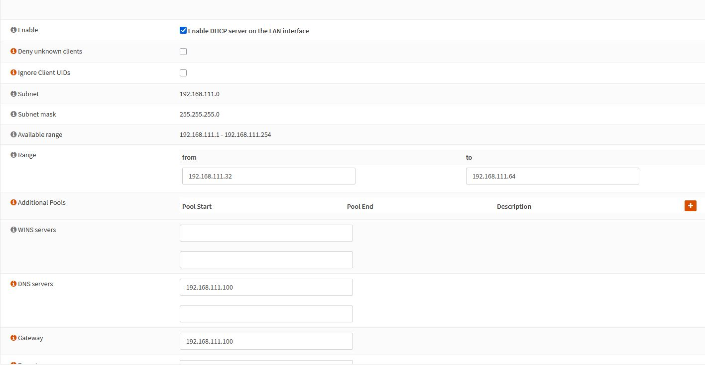

Final verified configuration:

| Setting | Value |
|---|---|
| Enable | ✅ Enabled |
| Subnet | 192.168.111.0 |
| Subnet Mask | 255.255.255.0 |
| Range Start | 192.168.111.32 |
| Range End | 192.168.111.64 |
| DNS Server | 192.168.111.100 |
| Gateway | 192.168.111.100 |

Setting both the DNS server and Gateway to the firewall
LAN IP `192.168.111.100` ensures any device connecting
to the LAN uses OPNSense as both its DNS resolver and
its default gateway for internet routing.

---

### Step 13 — General Settings & DNS Configuration

I navigated to **System → Settings → General** to configure
the firewall hostname, timezone, and upstream DNS server.

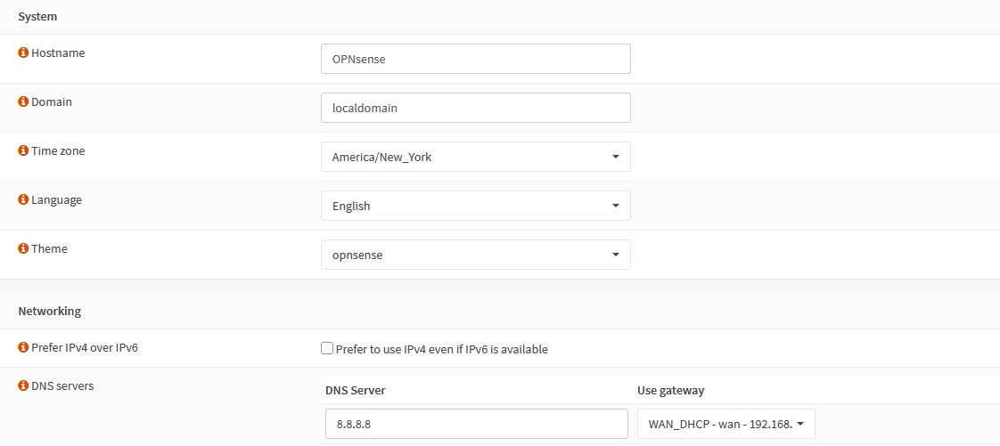

Settings configured:
- **Hostname:** OPNsense
- **Domain:** localdomain
- **Timezone:** America/New_York
- **DNS Server:** `8.8.8.8` (Google DNS) via WAN_DHCP gateway

Adding Google DNS as the upstream resolver ensures OPNSense
can forward DNS queries it cannot resolve locally out to
the internet for resolution.

**Note on DNS Service Selection:**
During configuration I initially attempted to use Unbound DNS
as the resolver. However Unbound failed to start consistently
in this OPNSense 21.7.1 environment. After troubleshooting
I identified the conflict and switched to Dnsmasq — a
lightweight DNS forwarder that is more reliable in virtualized
lab environments. Dnsmasq forwards DNS requests from LAN
clients directly to the upstream Google DNS server at `8.8.8.8`
rather than attempting full recursive resolution. This resolved
the issue and DNS worked correctly for all subsequent tests.

---

### Step 14 — Enabling SSH

I navigated to **System → Settings → Administration** and
enabled SSH access to the firewall for remote management
and future lab exercises.

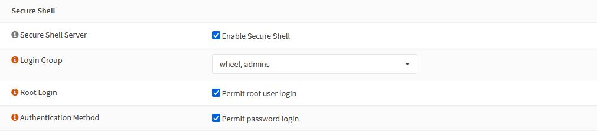

Settings enabled:
- ✅ Enable Secure Shell
- ✅ Permit root user login
- ✅ Permit password login

**Note:** Enabling root remote access is not recommended
in production environments. In this lab it is enabled for
convenience and future exercises. In a real deployment
certificate based authentication would replace password
login as a security best practice.

---

### Step 15 — DNS Resolution Testing

I navigated to **Interfaces → Diagnostics → DNS Lookup**
and tested resolution of `www.google.com` to verify the
upstream DNS configuration was working correctly from
the firewall itself.

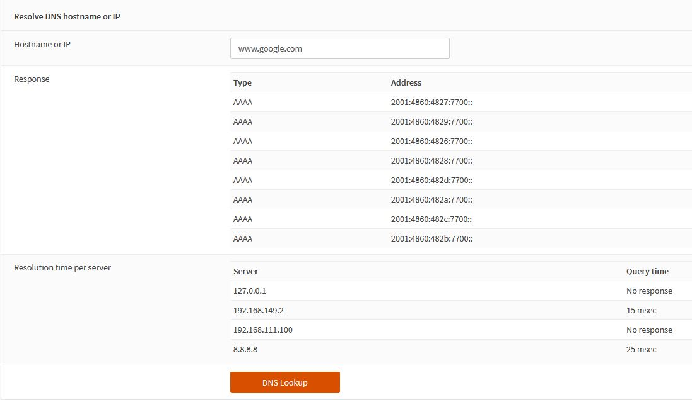

The lookup returned multiple valid IP addresses for
`www.google.com` confirming OPNSense can successfully
forward DNS queries to `8.8.8.8` and return results
to clients on the LAN.

---

### Step 16 — DSL VM Network Configuration

Before booting the DSL VM I verified its VMware network
adapter was set to **VMnet2** — the same Host-only network
as the OPNSense LAN interface.

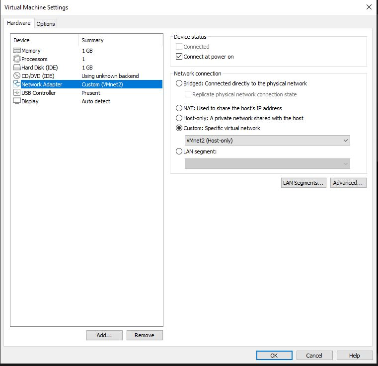

This ensures the DSL VM connects to the OPNSense LAN
and receives a DHCP address from the firewall rather
than from any other DHCP service.

---

### Step 17 — DSL VM DHCP Verification

After booting the DSL VM I opened a terminal and ran
`ifconfig` to verify it received an IP address from
the OPNSense DHCP server.

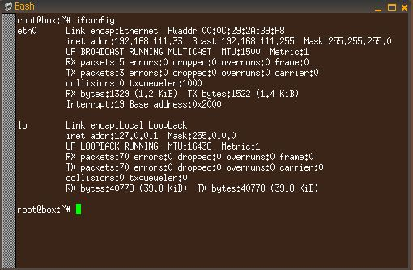

The DSL VM was assigned:
- **IP Address:** `192.168.111.33`
- **Subnet Mask:** `255.255.255.0`
- **Broadcast:** `192.168.111.255`

`192.168.111.33` falls within the configured DHCP range
of `.32` to `.64` confirming the OPNSense DHCP server
is functioning correctly and issuing addresses to LAN
clients as expected.

---

### Step 18 — End-to-End Connectivity Verification

With the DSL VM connected I ran a series of tests to
verify full end-to-end connectivity through the firewall.

**Test 1 — Ping OPNSense LAN Interface:**

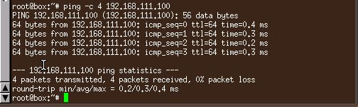

Successful ping to `192.168.111.100` confirms the DSL VM
can reach the OPNSense firewall over the LAN.

**Test 2 — Ping Internet:**

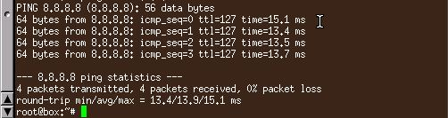

Successful ping to `8.8.8.8` confirms traffic is routing
correctly through OPNSense from the LAN to the internet.

**Test 3 — DNS Resolution:**

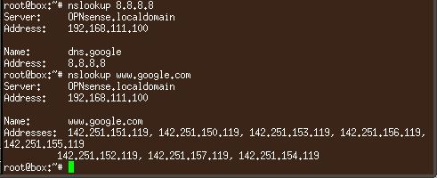

Successful DNS resolution for both `8.8.8.8` and
`www.google.com` using OPNSense as the DNS server at
`192.168.111.100`. Multiple valid IP addresses returned
for `www.google.com` confirming full DNS resolution
is working end to end through the firewall.

---

## Part 2 — Summary

| Task | Status |
|---|---|
| Web GUI Access | ✅ Complete |
| WAN Interface Settings | ✅ Complete |
| Dashboard Widgets | ✅ Complete |
| DHCP Verification & Fix | ✅ Complete |
| General Settings & DNS | ✅ Complete |
| SSH Enabled | ✅ Complete |
| DNS Resolution Test | ✅ Complete |
| DSL VM Connected | ✅ Complete |
| DHCP Verified on Client | ✅ Complete |
| End-to-End Connectivity | ✅ Complete |

The firewall is now fully configured and operational.
The LAN network is protected, DHCP is serving clients
correctly, DNS is resolving through OPNSense, and traffic
is routing from the private LAN through the firewall to
the internet.

---

## Part 3 — Firewall Rules & Traffic Control
*Coming soon*

---

## Part 4 — IDS/IPS with Suricata
*Coming soon*