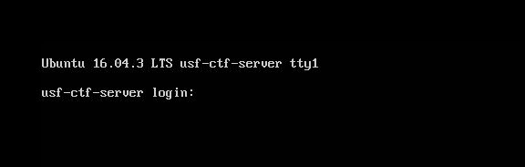
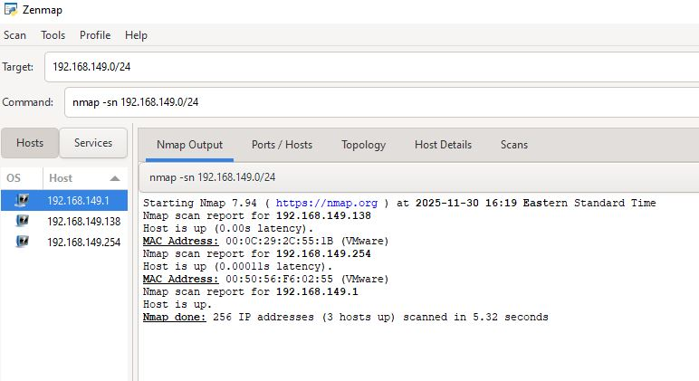
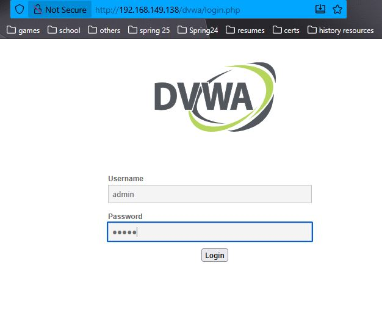
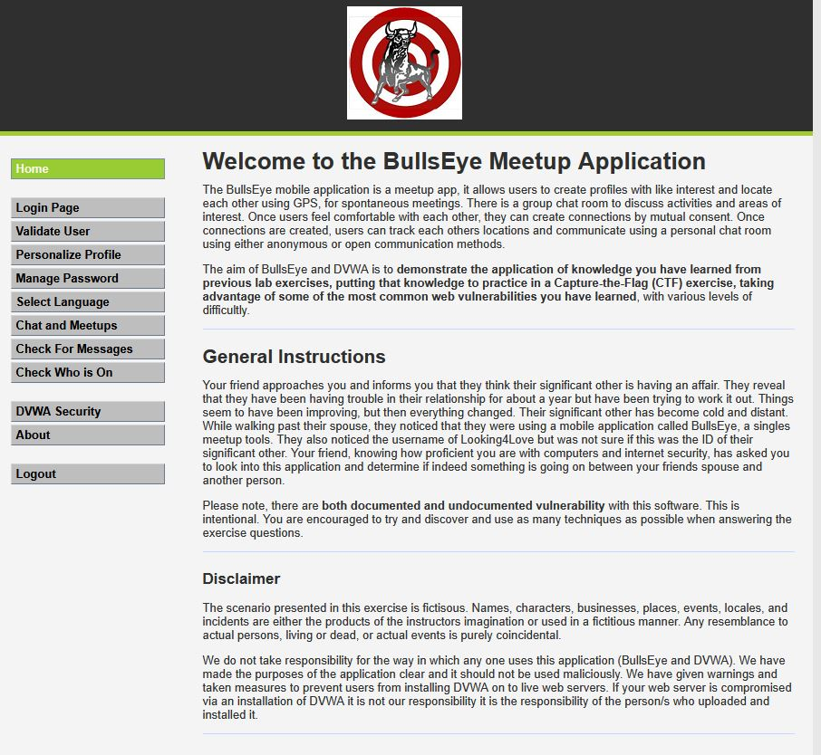
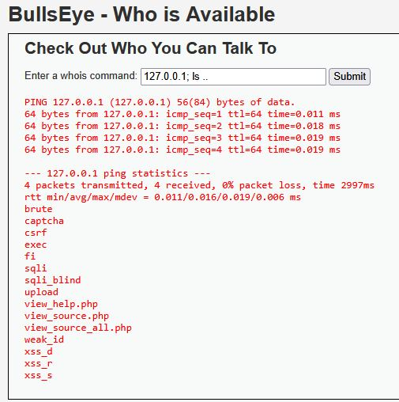
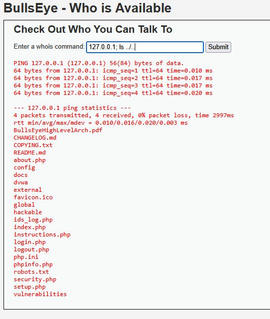
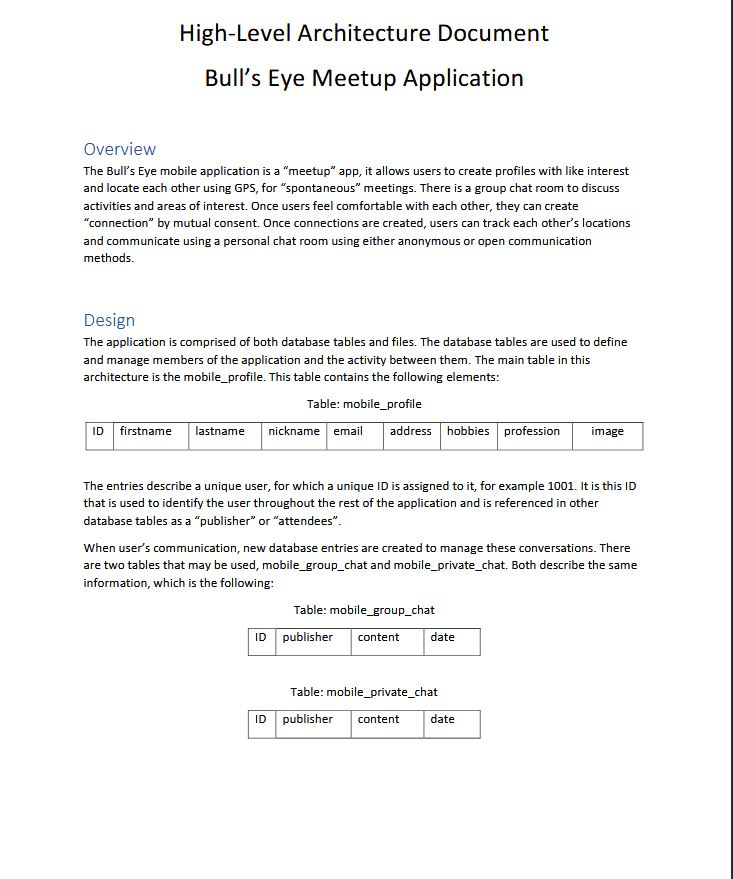
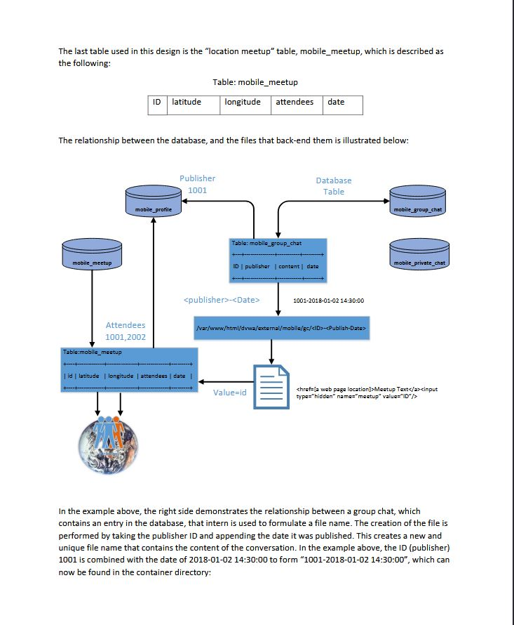
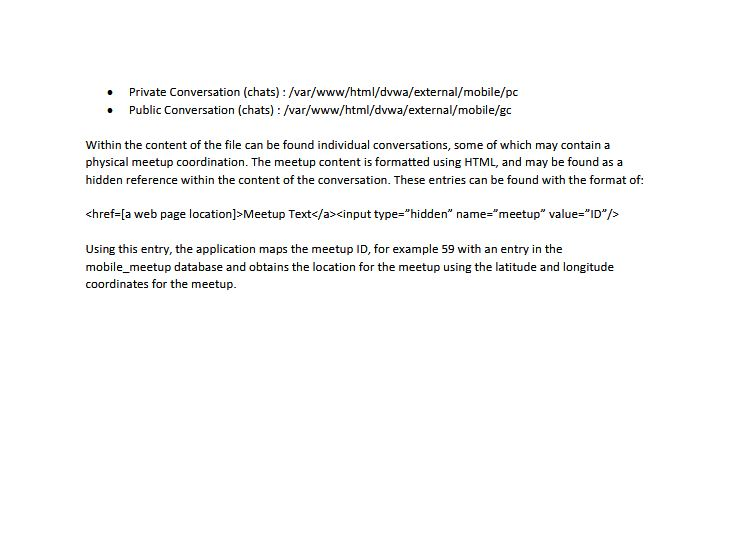
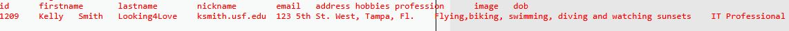

# BullsEye CTF — Command Injection & Database Enumeration
**Category:** Web Application Security / CTF  
**Platform:** DVWA — BullsEye Meetup Application  
**Date:** November 2025  
**Tools Used:** Nmap, Zenmap, Command Injection, MySQL, Firefox  

---

## Overview
This challenge presented a fictional scenario — a friend suspects
their spouse is cheating and asks me to investigate a dating app
called BullsEye running on a DVWA instance. The objective was to
confirm whether a user with the nickname "Looking4Love" was their
spouse, and gather evidence from the application's database.

The investigation required chaining multiple techniques together —
network reconnaissance, web application access, command injection,
directory traversal, architecture analysis, and direct database
enumeration via injected MySQL queries.

---

## Environment
- DVWA instance running BullsEye Meetup Application
- Ubuntu 16.04.3 LTS CTF server (usf-ctf-server)
- Zenmap/Nmap for network reconnaissance
- Firefox for web application interaction
- Target network: 192.168.149.0/24

---

## Methodology

### Step 1 — Initial Access & Reconnaissance
Upon booting the CTF VM I was met with an Ubuntu login console
with no credentials provided. Rather than attempting to log in
directly I shifted to network reconnaissance to gather information
about the environment.



I used Zenmap to run a host discovery scan against the NAT subnet:

```bash
nmap -sn 192.168.149.0/24
```

This returned three live hosts:
- `192.168.149.1` — my machine
- `192.168.149.138` — the CTF server
- `192.168.149.254` — network gateway



---

### Step 2 — Web Application Access
Knowing this was a DVWA based application I navigated to each
discovered host using the DVWA path:

http://192.168.149.138/dvwa/index.php

The login page for the BullsEye application was found at
`192.168.149.138`. I authenticated using default credentials:

- **Username:** admin
- **Password:** admin



Once inside I was presented with the BullsEye Meetup Application
— a fictional dating app with multiple navigation tabs including
"Check Who is On" and "Who Am I".



---

### Step 3 — Command Injection & Directory Traversal
The "Check Who is On" tab contained a text field that accepted
a whois command. I identified this as a potential command
injection point and tested it by appending a Linux command:

```bash
127.0.0.1; ls ..
```

The semicolon terminates the ping command and executes `ls ..`
as a separate OS command, listing the parent directory contents.



This revealed directory names including `brute`, `csrf`, `sqli`,
`sqli_blind`, and `upload` — confirming this was a DVWA
environment with multiple vulnerability modules.

I then navigated further up the directory tree:

```bash
127.0.0.1; ls ../..
```



This revealed a critical file — `BullsEyeHighLevelArch.pdf` — an
architecture document sitting in the web root.

---

### Step 4 — Architecture Document Analysis
I accessed the architecture document directly through the browser:

http://192.168.149.138/dvwa/BullsEyeHighLevelArch.pdf

This document revealed the complete database schema for the
BullsEye application including table names, column names, and
the relationships between them.

**Key tables identified:**

| Table | Columns |
|---|---|
| mobile_profile | id, firstname, lastname, nickname, email, address, hobbies, profession, image |
| mobile_group_chat | id, publisher, content, date |
| mobile_private_chat | id, publisher, content, date |
| mobile_meetup | id, latitude, longitude, attendees, date |







The main table of interest was `mobile_profile` — this is where
user identity information including nicknames would be stored.

---

### Step 5 — Database Credential Discovery
I navigated to the "Who Am I" tab and injected a command to view
the PHP source code. While the output wasn't visible in the normal
browser window — because the PHP tags were being interpreted as
HTML — viewing the page source revealed the database credentials:

```php
$_DVWA['db_server']   = '127.0.0.1';
$_DVWA['db_database'] = 'dvwa';
$_DVWA['db_user']     = 'root';
$_DVWA['db_password'] = 'ctf';
```

---

### Step 6 — MySQL Database Enumeration
Armed with the database credentials and schema I injected a
direct MySQL query through the command injection field to search
for the target nickname:

```bash
127.0.0.1; mysql -u root -pctf dvwa -e "SELECT id,nickname FROM mobile_profile;"
```

Breaking this down:
- `127.0.0.1;` — pings loopback to keep the command local, then terminates
- `mysql -u root -pctf dvwa` — connects to MySQL as root with password `ctf` using the `dvwa` database
- `-e "SELECT id,nickname FROM mobile_profile;"` — executes the query without opening an interactive prompt

This returned a full list of user profiles. The target was
identified:

id: 1209 | nickname: Looking4Love

I then ran a second query to pull the complete profile for id 1209:

```bash
127.0.0.1; mysql -u root -pctf dvwa -e "SELECT * FROM mobile_profile WHERE id=1209;"
```

---

### Step 7 — Target Identified
The query returned the full profile of the target:



| Field | Value |
|---|---|
| ID | 1209 |
| First Name | Kelly |
| Last Name | Smith |
| Nickname | Looking4Love |
| Email | ksmith.usf.edu |
| Address | 123 5th St. West, Tampa, FL |
| Hobbies | Flying, biking, swimming, diving, watching sunsets |
| Profession | IT Professional |

**Investigation conclusion:** The user "Looking4Love" was
confirmed to be Kelly Smith — the suspect's spouse — actively
using the BullsEye dating application.

---

## Key Findings

**Vulnerability 1 — Command Injection**
The "Check Who is On" input field passed user input directly to
the OS without sanitization. This allowed arbitrary command
execution on the server.

**Vulnerability 2 — Sensitive File Exposure**
The architecture document `BullsEyeHighLevelArch.pdf` was stored
in the publicly accessible web root and could be retrieved by
anyone who discovered its path.

**Vulnerability 3 — Hardcoded Database Credentials**
Database credentials were stored in plaintext in the PHP
configuration file and were retrievable through command injection.

**Vulnerability 4 — Default Credentials**
The application was accessible using default admin/admin
credentials with no password policy enforced.

---

## Mitigation Recommendations
- **Sanitize all user inputs** — never pass user input directly
to OS commands. Use allowlists for expected input formats.
- **Move sensitive files outside the web root** — architecture
documents and configuration files should never be accessible
via browser
- **Use environment variables for credentials** — never hardcode
database credentials in application files
- **Enforce strong password policies** — disable or change all
default credentials before deployment
- **Implement a Web Application Firewall (WAF)** — to detect
and block command injection patterns

---

## What This Demonstrates
- Network reconnaissance using Nmap/Zenmap
- Web application vulnerability identification
- Command injection exploitation — OWASP Top 10
- Directory traversal through injected commands
- Sensitive file discovery and analysis
- Database credential extraction from source code
- MySQL query execution via command injection
- Structured CTF investigation methodology

---

## Lessons Learned
This challenge demonstrated how a single unvalidated input field
can become a gateway to the entire server. By chaining command
injection with directory traversal and database enumeration I was
able to move from zero access to full database read capability
without ever needing a dedicated exploit tool. The most dangerous
vulnerabilities are often the simplest ones — unsanitized input
accepted by the application and passed directly to the operating
system.